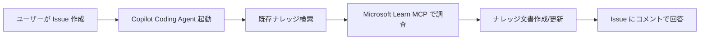

# demo-copilot-support

GitHub Copilot Coding Agent を活用した IT サポート問い合わせ自動対応のデモリポジトリです。

## 概要

IT システムの問い合わせ対応を GitHub Issue + Copilot Coding Agent で自動化するワークフローを実演します。

```
Issue（問い合わせ） → Copilot 調査 → ナレッジ蓄積 → Issue 回答
```

### ワークフロー



## 特徴

- **Issue ドリブン**: 問い合わせは GitHub Issue テンプレートで構造化
- **自動調査**: Copilot Coding Agent が Microsoft Learn MCP を使い公式ドキュメントを検索・参照
- **ナレッジ蓄積**: 調査結果を `knowledge/` に Markdown で保存。Git 管理で履歴が残る
- **調査記録**: Issue 固有の調査プロセスを `investigations/` に記録
- **再利用**: 同種の問い合わせに対して既存ナレッジを即座に参照

## セットアップ

### 1. リポジトリのクローン

```bash
git clone https://github.com/openjny/demo-copilot-support.git
```

### 2. MCP サーバー設定（GitHub リポジトリ設定）

リポジトリの **Settings > Copilot > MCP servers** から以下を追加：

```json
{
  "microsoft-learn": {
    "type": "http",
    "url": "https://learn.microsoft.com/api/mcp"
  }
}
```

### 3. ローカル開発（VS Code）

`.vscode/mcp.json` が含まれているため、VS Code で開けば Microsoft Learn MCP が自動的に有効になります。

## デモシナリオ例

1. Issue テンプレート「問い合わせ」を使って Issue を作成
   - 例:「Azure App Service で 503 エラーが頻発する」
2. Copilot Coding Agent を Issue にアサイン
3. Agent が自動で調査を開始し、ナレッジ文書を作成
4. Issue に調査結果と対応方法をコメント

## ファイル構造

```
.github/
  copilot-instructions.md   — Copilot Coding Agent への指示
  agents/support.agent.md   — サポートエージェント定義
  ISSUE_TEMPLATE/inquiry.yml — 問い合わせテンプレート
.vscode/mcp.json            — Microsoft Learn MCP 設定（ローカル用）
knowledge/                  — 再利用可能なナレッジベース
  azure/                    — Azure 関連
  m365/                     — Microsoft 365 関連
  security/                 — セキュリティ関連
investigations/             — Issue 固有の調査記録
docs/DESIGN.md              — 設計思想・存在理由
```

## ライセンス

MIT
